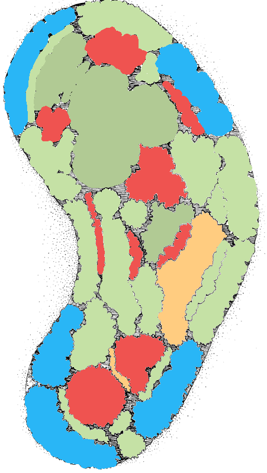

## GaCK: Garden Creation Kit




### Supported constraints

These are the constraints implemented in Prototype2.

Always active:

- Colour variety constrant: adjacent cells should have different colour
- Moisture constraint: adjacent cells should have similar moisture requirements
- Height constrant: cells closer to the edge should be shorter than neighbours further from the edge
- Traffic: do not choose plants that can only handle low traffic for border cells
- Spread: do not choose plants that requires more room than the cell can provide
- Availability: cell properties must match at least one plant from the perennial.com database of perennials

User-configurable:

- User-configurable priority for seasons (which season should have more colour variation)
- User-configurable priority for colour choices (which colours are picked first in the solution)
- User can choose to force a cell to a certain colour/certain colours
- User can specify to avoid two colours from being placed next to each other
- User can specify a preference to have two colours adjacent to each other

### Setup

Toulbar2 is required to run this program. Run

`./setup_toulbar.sh`

to download and install Toulbar2 in the current directory.

### Running GaCK

There are two versions of the program: Prototype1 (older and simpler version, used as baseline to compare the newer Prototype2 against) and Prototype2 (latest version). To use:

```
cd prototype1
./toulbar_run.sh
```

replace prototype1 with prototype2 to run prototype2.

Prototype2 can be configured with the prototype2/user_prefs.txt file (documented in the next section). Prototype1 is not configurable and has a hardcoded constraint for cell 3 to be red in summer.

To visualize the results, paste the result into the source of draw_results.html, and click "Spring", "Summer", or "Fall" to visualize the colours of the garden in each respective season.

### User configuration (Prototype2 only)

The configuration file, prototype2/user_prefs.txt, has the following format:
Edit the file to change the preferences.

```
key space separated values
```

Mandatory keys:

- color_rank: order that the colours are chosen.

Colours: 0 - red, 1 - orange, 2 - yellow, 3 - green, 4 - blue, 5 - violet

e.g. to specify preference of violet, then blue, then orange, yellow, green, red:

color_rank 5 4 1 2 3 0

- season_rank: order of preference for colour diversity for each season.

Seasons: spring, summer, fall

e.g. to specify that highest colour diversity should be in summer, then fall, the spring:

season_rank summer fall spring

Optional keys:

- cell_force_(index)_(season) (color1) (color2)..

where index is the cell index (1-39), season is one of the seasons, and colour is one of the integers for color as specified above:

Force a cell to have one of the specified colours during a season.

For example, to force cell 3 to be red in summer:

cell_force_3_summer 0

You can also have disjunctive constraints - forcing cell 3 to be red or blue in spring:

cell_force_3_spring 0 4

- colorclash (weight) (color1) (color2)

Specifies that those two colours shouldn't be placed next to each other. Color1, color2 are in the same integer format as above.

Lowest weight is 1; weight of 10 means this is just as important as colour variety.

You can specify multiple colorclash preferences and they will all be taken into consideration according to their weights.

For example, to prevent red and blue from being placed together:

colorclash 5 0 4

- coloradj (weight) (color1) (color2)

Opposite of colorclash: this is for colours that should be adjacent. Usage is same as colorclash.

### Other experiments

We developed our own weighted CSP solver; this is located in cspbase.py. Unfortunately the performance was not sufficient for this assignment, so Toulbar2 was used instead. More information can be found in our report.

Three benchmarks of this solver is included:

- ourcsp_warehouse.py: port of Toulbar2's validation/default/warehouse.cp

To run ourcsp_warehouse.py:

`python3 ourcsp_warehouse.py`

To run the equivalent test using Toulbar2:

`time ./toulbar_translateandrun.sh toulbar2-0.9.8-x86_64/share/doc/validation/default/warehouse.cp`

- ourcsp_warehouse_allsoft.py: warehouse with all hard constraints converted to soft constraints of 10000 weight each

To run ourcsp_warehouse_allsoft.py:

`python3 ourcsp_warehouse_allsoft.py`

To better exercise the heuristics, run ourcsp_warehouse_varyingsoft.py:

`python3 ourcsp_warehouse_varyingsoft.py`

To run the equivalent test using Toulbar2:

`time ./toulbar_translateandrun.sh warehouse_allsoft.cp`

- ourcsp_celar.py: port of Toulbar2's validation/default/celar6sub0.cp

To run ourcsp_celar.py:

`python3 ourcsp_celar.py`

To run the equivalent test using Toulbar2:

`time ./toulbar_translateandrun.sh toulbar2-0.9.8-x86_64/share/doc/validation/default/celar6sub0.cp`
